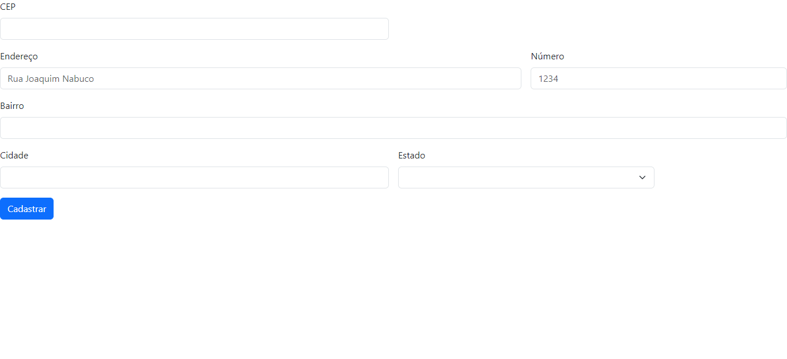

# Projeto-CadEndereco

## Índice

[Projeto](https://github.com/vickieww/Projeto-CadEndereco#projeto)

[Descrição](https://github.com/vickieww/Projeto-CadEndereco/blob/main/README.md#descri%C3%A7%C3%A3o)

[Orientações](https://github.com/vickieww/Projeto-CadEndereco#orienta%C3%A7%C3%B5es)

[Funcionalidades](https://github.com/vickieww/Projeto-CadEndereco#-funcionalidades)

[Tecnologias Utilizadas](https://github.com/vickieww/Projeto-CadEndereco/blob/main/README.md#tecnologias-utilizadas)

[Fontes Consultadas/Conteúdos estudados](https://github.com/vickieww/Projeto-CadEndereco#fontes-consultadasconte%C3%BAdos-estudados)

[Autores](https://github.com/vickieww/Projeto-CadEndereco#autores)

## Projeto

    

## Descrição  

Projeto criado durante a aula de Programação Web 1 para a facção de um site de cadastro e confirmação de CEP e endereço que utilizando Bootstrap. Fizemos a tradução e a modificação de acordo com os requisitos necessários para o nosso projeto. 

## Orientações

- `Bootstrap`: Código retirado do site BootsTrap e adaptado conforme os requisitos do site. 
 
   

- `JavaScript`: Criamos um código de verificação e alteração dos campos.

- `Alterações no HTML`: alteramos o código HTML como os campos col-, form, div e outros conforme as necessidades do site.

- `Método Arrow`: aplicamos no JavaScript uma série de funções, como a function arrow em conjunto com o método test que executa uma busca por uma correspondência entre uma expressão regular e uma string para limpar os campos preenchidos incorretamente, com número inválido de caracteres ou com caracteres que não são números.
 
- `Async e Fetch`: utiliza como API o código, o link/URL do site ViaCep junto ao método fetch para poder realizar a consulta no site da ViaCep com tipo de retorno json como formato/padrão de texto de resposta e retorná-lo ao usuário do nosso site. 

- `hasOwnProperty`: verifica se há algum erro de consulta do site utilizado (ViaCep).

- `addres`: utiliza o retorno padrão jSon para preencher os campos de formulário com as informações retiradas do site ViaCep com os métodos Async e Fetch.

- `addEventListener`: aciona as funções no site ao clicar fora do campo de CEP. Permite que você configure funções a serem chamadas quando um evento específico acontece, como, por exemplo, quando um usuário clica em um botão. 

- `ViaCep`: site utilizado como API para a consulta de CEP com o padrão de linguagem jSon.

## 🔧 Funcionalidades

- `Consulta de CEP`: o site, através das funções aplicadas no JavaScript, realiza uma busca de endereço com o número do CEP inserido pelo usuário.
  
- `Limpar campos preenchidos`: utiliza a Arrow Function e o método test que executa uma busca por uma correspondência entre uma expressão regular e uma string para limpar os campos preenchidos incorretamente, com número inválido de caracteres ou com caracteres que não são números.

- `Preenche campos do formulário`: preenche o os campos restantes de rua, bairro, cidade e estado conforme o cep indicado pelo usuário. Para realizar esse preenchimento, foi utilizado as informações e o código de referência para buscar as informações dentro dos Correios. 

- `Tela adaptável`: a tela se adapta a diversos dispositivos conforme o site do bootstrap.
  

## Tecnologias Utilizadas
- GitHub
- HTML 5
- Bootstrap 5
- JavaScript

## Fontes Consultadas/Conteúdos estudados

 * [Mozilla](https://developer.mozilla.org/pt-BR/docs/Learn/JavaScript/First_steps/Arrays)
 * [Bootstrap 5](https://getbootstrap.com/docs/5.3/forms/layout/)
 * [Alura](https://cursos.alura.com.br/forum/topico-array-130461)
 * [RegExpal](https://www.regexpal.com/)

## Autores

|  [ Larissa Manrique](https://github.com/larissassk) | [ Vitória Gabrieli ](https://github.com/vickieww) | [ Leonardo Rocha ](https://github.com/LeonardoRochaMarista) |
| :---: | :---: | :---: |

